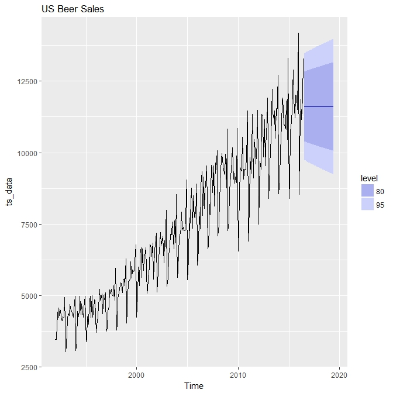

layout: post
title:  "A Primer on Time Series using R and Python"
date:  2016-07-17
categories: R, Python

Time Series is an area of data science which is often overlooked. The majority of books and tutorials mainly focus on traditional <b> Classification </b> and <b> Regression </b> based problems. In this blog, we will look at variety of forecasting time series techniques utilizing the programming languages R and Python.

The topics to be covered include:

* Naive method
* Simple Average
* Moving Average
* Exponential Smoothing
* Holt's Winter method
* ARIMA

We will be using the daily US Beer Sales dataset  as a way of comparing each of the forecasting techniques. The data is comprised of 1992-2016 overtime as shown in the table below. The main packages used are <i>forecast</i> package for R and <i>statsmodels</i> package for Python.

## Naive Method

The <b>Naive</b> approach is the most simplest forecasting technique, taking the last data point available and forecasting all future values based on this value. The below code represents how simplicity of the implementation. This method is most effective if the time series is quite stable overtime.

    #R
    data[nrow(data)-1,] #Extract the last value
    
    #Python
    data[len(data)-1] #Extract the last value

## Simple Average

You can see how using Naive method might create some issues if the last value is unusually high or low. Another way to tackle this problem is to take a <b>Simple Average </b>, which is calculated by taking an average of all previous values. This technique can smooth out volatility in the data.

    #R
    mean(data$value)
    
    #Python
    data.value.mean()

## Moving Average

A variation to the Simple Average is the <b>Moving Average</b>. Using a specified window (e.g 12) take the average of those data points and then shift one point and repeat. The benefit of using a moving average is that it can capture the direction or as it is also called "Trend" of the data.

    #R
    library(forecast)
    ma(train$count, order = 12)
    
    #Python
    train['Count'].rolling(12).mean()

## Exponential Smoothing

We have looked at a few examples involving taking averages of past points, in many cases, only the most recent information is needed to influence our future forecast. <b>Exponential Smoothing</b> applies a weighting to past values with larger weights assigned to more recent observations.

    #R
    library(forecast)
    ses(data, alpha = 0.2, initital = "simple", h = 36)
    #Python
    
    from statsmodels.tsa.api import SimpleExpSmoothing
    fit = SimpleExpSmoothing(np.asarray(train['Count'])).fit(smoothing_level = 0.2, optimzed = False)
    fit.forecast(len(test))

## Holt Winters

The <b>Holt Winters</b> technique extends the simple exponential smoothing. It can be summarised in the below equation which essentially combines the original exponential smoothing with a trend and seasonal component.

    #R
    library(forecast)
    fit <- hw(data, seasonal = "additive")
    
    # "ets" function is an automated version
    ets_model <- ets(ts_data)
    ets_forecast <- forecast(ets_model, h = 36)
    
    #Python
    from statsmodel.tsa.api import ExponentialSmoothing
    fit = ExponentialSmoothing(np.asarray(train['Count]), seasonal_period = 7, trend = 'add', seasonal = 'add')

## Arima

Another popular method is <b>Arima</b> which stands for <i> Autoregressive Integrated Moving Average</i>. One of the main differences compared to the previous methods is that it is based on correlations.

    #R
    library(forecast)
    fit <- auto.arima(data)
    
    #Python
    from statsmodels.tsa.statespace import SARIMAX
    
    fit = SARIMAX(train['count'], order = (2,1,4), seasonal_order = (0,1,1,7)).fit()

## Conclusion

In this blog we have explored a variety of different forecasting techniques which can be easily applied. The choose of technique depends significantly on the data, for example, determining whether there is a particular trend or seasonality. 

One of the main take always, is that there is not a single technique which is supreme but it depends on the particular dataset. Benchmarking each method such as determining which has the lowest <b>RMSE</b> is a strategy to determine which model to use.  

